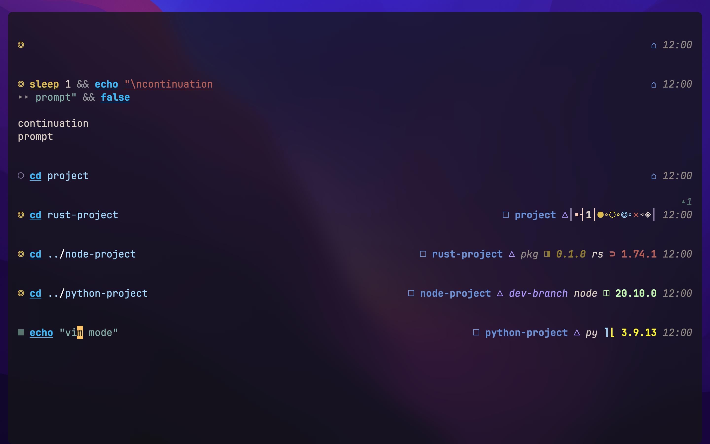
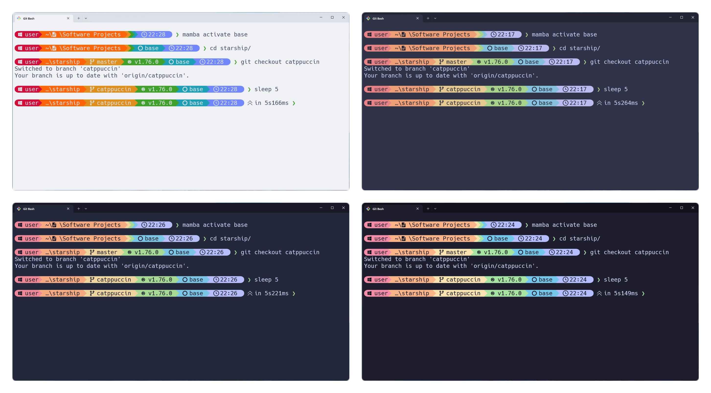
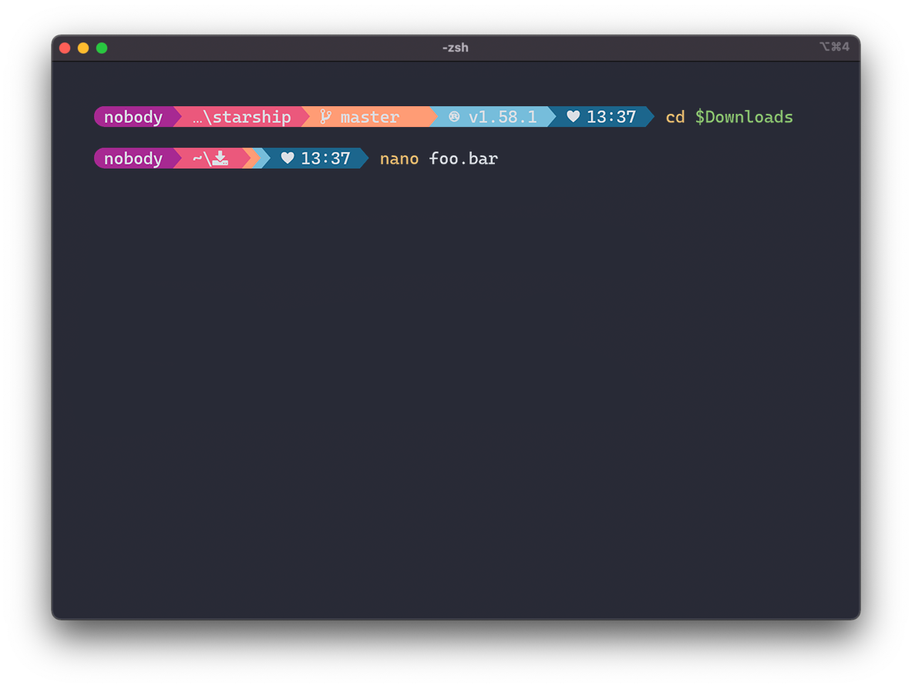

# Starship prompt themes

*Read this in [繁體中文](README.zh-TW.md).*

Ready-made themes ("presets") for the [Starship](https://starship.rs) shell prompt.
Starship draws the informative, good-looking prompt line you see in your terminal.

## Files

Each theme is a `.toml` config with a matching `.png` preview:

| Preset | Config |
| --- | --- |
| Tokyo Night | `tokyo-night.toml` |
| Jetpack | `jetpack.toml` |
| Catppuccin Powerline | `catppuccin-powerline.toml` |
| Pastel Powerline | `pastel-powerline.toml` |
| Powerlevel10k look-alike | `p10k.toml` |

`link.sh` symlinks all presets into `~/.config/starship/`.

## Previews

### Tokyo Night


### Jetpack


### Catppuccin Powerline


### Pastel Powerline


## Requirements

```sh
brew install starship
```

## Install

From the repo root run `make links`, or just this folder:

```sh
sh starship/link.sh
```

## Choosing a theme

Starship reads whichever config the `STARSHIP_CONFIG` environment variable points at:

```sh
export STARSHIP_CONFIG="$HOME/.config/starship/tokyo-night.toml"
```

If you use the [`zsh/`](../zsh) setup in this repo, you don't need to set that by hand.
Just tell it which preset to use in `~/.zshenv.local`:

```sh
ZSH_PROMPT=starship              # turn on the Starship prompt
ZSH_STARSHIP_PRESET=tokyo-night   # or: jetpack, catppuccin-powerline, pastel-powerline, p10k, random
```

Setting `ZSH_STARSHIP_PRESET=random` picks a different theme each time you open a shell.
